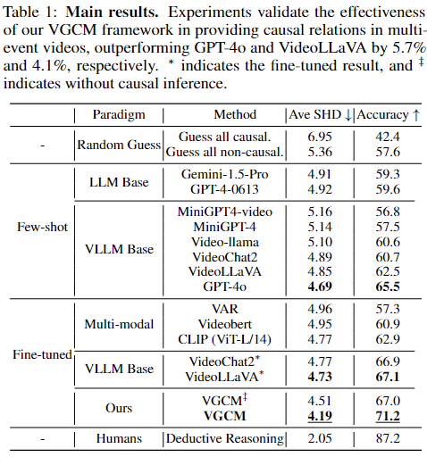

## Our paper was accepted in NeurIPS 2024 as a Spotlight Paper!-2024.9.26
## 1. Dataset MECD
Our MECD dataset includes 808 and 299 videos for training set and testing set, respectively.

The annotations of training set: `captions/train.json` 

The annotations of testing set:  `captions/test.json` 

The videos can be found in ActivityNet official website https://activity-net.org/ according to our provided video ID.

The pretrainig feature extracted by ResNet200 can be got by following the command below:
```bash
python feature_kit/extract_feature.py
```
And the pretraining weights of VGCM will be unpoladed soon.
## 2. Training for VGCM
For training our VGCM, run 
```bash 
sh scripts/train.sh 
```
#### Benchmark Results 


#### Hyperparameters settings
To reproduce our results in the above table, please follow the default hyperparameters settings in: `src/runner.py` and `scripts/train.sh`

## 3. Finetuning Video-LLaVA and VideoChat2 on MECD
We fine-tune the vision-language projector of Video-LLaVA and VideoChat2 using LoRA under its official implementation on our entire MECD training set. 
Please follow the command to reproduce thr fine-tuning result on our MECD benchmark:

Video-LLaVA
```bash
cd mecd_vllm_finetune/Video-LLaVA-ft
sh scripts/v1_5/finetune_lora.sh 
```
VideoChat2
```bash
cd mecd_vllm_fewshot/VideoChat2-ft
OMP_NUM_THREADS=2 torchrun --nnodes=1 --nproc_per_node=8 tasks/train_it.py ./scripts/videochat_mistral/config_7b_stage3.py
```
## 4. Few-shot Evaluation of LLMs &VLLMs
All LLM-based and VLLM-based models are evaluated under a few-shot setting (In-Context Learning). 
Specifically, following the approach in causal discovery for NLP tasks and after proving the sufficiency, 
three representative examples are provided during inference. 
Examples can be found in `mecd_llm_fewshot/prompt.txt`, `mecd_vllm_fewshot/video_chat2/multi_event.py`, 
and `mecd_vllm_fewshot/Video-LLaVA/videollava/conversation.py`. 
#### Video-LLaVA
Please follow the command to evaulate the causal discovery ability of Video-LLaVA:
```bash
cd mecd_vllm_fewshot/Video-LLaVA
python videollava/eval/video/run_inference_causal_inference_complete.py
```
#### Videochat2
Similarly, please follow the command to evaulate the causal discovery ability of Videochat2:
```bash
cd mecd_vllm_fewshot/VideoChat2
python multi_event.py
```
#### GPT-4
Similarly, please follow the command to evaulate the causal discovery ability of GPT-4:
```bash
cd mecd_llm_fewshot
python gpt4.py
```
#### Gemini-pro
Similarly, please follow the command to evaulate the causal discovery ability of Gemini-pro:
```bash
cd mecd_llm_fewshot
python gemini.py
```


