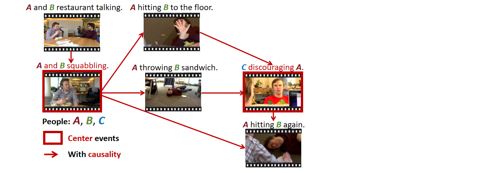
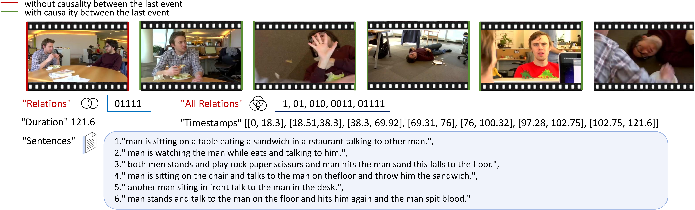

<h2 align="center"> <a href="https://arxiv.org/abs/2409.17647">MECD: Unlocking Multi-Event Causal Discovery in Video Reasoning</a></h2>

<h5 align="center"> NeurIPS 2024 (Spotlight)  </h2>

<h5 align="center"> If you like our project, please give us a star ⭐ on GitHub for latest update.  </h2>

[](https://arxiv.org/abs/2409.17647) <br>

[](https://paperswithcode.com/sota/causal-discovery-in-video-reasoning-on-mecd?p=mecd-unlocking-multi-event-causal-discovery)

[](https://huggingface.co/datasets/tychen-sjtu/MECD)


## 📰 News
[2024.09.26] 🔥🔥🔥 Our MECD is accepted in NeurIPS 2024 as a **Spotlight** Paper!

[2025.07.05] MECD+ dataset public available.

## 🏠 Overview


Video causal reasoning aims to achieve a high-level understanding of video content from a causal perspective. 
However, current video reasoning tasks are limited in scope, primarily executed in a question-answering paradigm 
and focusing on short videos containing only a single event and simple causal relations. 
To fill this gap, we introduce a new task and dataset, Multi-Event Causal Discovery (MECD). 
It aims to uncover the causal relations between events distributed chronologically across long videos.

To address MECD, we devise a novel framework inspired by the Granger Causality method, 
using an efficient mask-based event prediction model to perform an Event Granger Test, 
which estimates causality by comparing the predicted result event when premise events are masked versus unmasked. 
Furthermore, we integrate causal inference techniques such as front-door adjustment and 
counterfactual inference to address challenges in MECD like causality confounding and illusory causality.

An example of causality diagram:



## 📊 MECD Dataset
Our MECD dataset includes 806 and 299 videos for training set and testing set, respectively.


The annotations of training set: `captions/train.json`, the causal relation attribute 'relation' is introduced.

The annotations of testing set:  `captions/test.json`, the causal relation attribute 'relation' is introduced.

Full causal relation diagram annotations of the test set can be found at `captions/test_complete.json`, an additional attribute 'all_relation'
is introduced to conduct complete causal graph reasoning which is evaluated by the 'Average_Structural_Hamming_Distance (Ave SHD)' metric. 

An annotation example (Annotation display version can also be viewed at [HunggingFace](https://huggingface.co/datasets/tychen-sjtu/MECD)):



The videos can be found in ActivityNet official website https://activity-net.org/ according to our provided video ID.

For the latest download issues related to ActivityNet, you can refer to the answer in: [Official Repository Issue](https://github.com/activitynet/ActivityNet/issues/103). 

The latest download request form is available in: [Request Form](https://docs.google.com/forms/d/e/1FAIpQLSdxhNVeeSCwB2USAfeNWCaI9saVT6i2hpiiizVYfa3MsTyamg/viewform).

The link to the 8-frame sampled results for all videos in MECD is available in: [Google Drive](https://drive.google.com/file/d/1h10MEKN_p1iDEhWZ8kbLraV38_1SeHvG/view?usp=drive_link).

The pretraining feature extracted by ResNet200 can be got by following the command below (details can be found in [VAR](https://github.com/leonnnop/VAR)) :
```bash
python feature_kit/extract_feature.py
```

[2025.07.05] Update: The newly introduced training data in MECD+ can be found in `captions/train_mecd_plus.json`, the corresponding video_id can be found in [Eventbench](https://huggingface.co/datasets/RUCAIBox/Event-Bench).
You can download the Eventbench dataset, where all the videos we introduced can be found with their corresponding original video sources.
MECD+ paper (Under IEEE TPAMI 2nd Round Review) can be found in: [](https://arxiv.org/abs/2501.07227).

## 🗝️ Training & Validating 
For training and our validating VGCM(Video Granger Causality Model), please follow the command below:
```bash 
sh scripts/train.sh 
```
#### 🚀 Benchmark Results 


#### 📃 Hyperparameters settings
To reproduce our results in the above table, please follow the default hyperparameters settings in: `src/runner.py` and `scripts/train.sh`

## 🔥 Fine-tuning & Evaluation of VLLMs
We fine-tune the vision-language projector of 🦙Video-LLaVA and 🦜VideoChat2 using LoRA under its official implementation on our entire MECD training set. 
During the fine-tuning phase, the relation is transformed into a list of length (n-1), and the regular pattern of causality representation offered by the conversation is supplied to the VLLM.
Task prompt can be found in (`mecd_vllm_finetune/Video-LLaVA-ft/videollava/conversation.py` and `mecd_vllm_finetune/VideoChat2-ft/multi_event.py`) :
```bash
system = "Task: The video consists of n events, 
and the text description of each event has been given correspondingly(separated by " ",). 
You need to judge whether the former events in the video are the cause of the last event or not, 
the probability of the cause 0(non-causal) or 1(causal) is expressed as the output, "
```
Please follow the command to reproduce thr fine-tuning result on our MECD benchmark:

Evaluate the causal discovery ability after fine-tuning of 🦙Video-LLaVA:
```bash
cd mecd_vllm_finetune/Video-LLaVA-ft
sh scripts/v1_5/finetune_lora.sh 
python videollava/eval/video/run_inference_causal_inference.py
```
Evaluate the causal discovery ability after fine-tuning of 🦜VideoChat2:
```bash
cd mecd_vllm_fewshot/VideoChat2-ft
OMP_NUM_THREADS=2 torchrun --nnodes=1 --nproc_per_node=8 tasks/train_it.py ./scripts/videochat_mistral/config_7b_stage3.py
python multi_event.py
```
## ❄️ Few-shot (In-Context Learning) Evaluation of LLMs &VLLMs
All LLM-based and VLLM-based models are evaluated under a few-shot setting (In-Context Learning). 
Specifically, following the approach in causal discovery for NLP tasks and after proving the sufficiency, 
three representative examples are provided during inference, which can be found in `mecd_llm_fewshot/prompt.txt`, `mecd_vllm_fewshot/video_chat2/multi_event.py`, 
and `mecd_vllm_fewshot/Video-LLaVA/videollava/conversation.py`. 
#### 🦙Video-LLaVA
Please follow the command to evaluate the In-Context causal discovery ability of Video-LLaVA:
```bash
cd mecd_vllm_fewshot/Video-LLaVA
python videollava/eval/video/run_inference_causal_inference.py
```
#### 🦜Videochat2
Similarly, please follow the command to evaluate the In-Context causal discovery ability of Videochat2:
```bash
cd mecd_vllm_fewshot/VideoChat2
python multi_event.py
```
#### GPT-4
Similarly, please follow the command to evaluate the In-Context causal discovery ability of GPT-4:
```bash
cd mecd_llm_fewshot
python gpt4.py
```
#### Gemini-pro
Similarly, please follow the command to evaluate the In-Context causal discovery ability of Gemini-pro:
```bash
cd mecd_llm_fewshot
python gemini.py
```

##  Video Question Answering Enhancement
Additional causal relations facilitates VLLM with stronger VideoQA ability.
527 examples overlap between our MECD dataset and the ActivityNet-QA dataset: `question_answering/QA.json`.
No additional training process is needed.

The example of facilitating VideoChat2 QA process:
```bash
cd mecd_vllm_fewshot/VideoChat2-ft
python run_qa_causal_mistral.py
```

## 🛠️ Requirements and Installation
First, you will need to set up the environment and extract pretraining weight of each video.
We offer an environment suitable for both VGCM and all VLLMs:
```bash
conda create -n mecd python=3.10
conda activate mecd
pip install -r requirements.txt
```
The pre-training weight of VGCM is available in [Google Drive](https://drive.google.com/file/d/1FScQim-nPgpr-SYRPIzVd5Dg6YYJbwQ1/view?usp=sharing).

## ✏️ Citation
```bash
@article{chen2024mecd,
  title={MECD: Unlocking multi-event causal discovery in video reasoning},
  author={Chen, Tieyuan and Liu, Huabin and He, Tianyao and Chen, Yihang and Ma, Xiao and Zhong, Cheng and Zhang, Yang and Wang, Yingxue and Lin, Hui and Lin, Weiyao and others},
  journal={Advances in Neural Information Processing Systems},
  volume={37},
  pages={92554--92580},
  year={2024}
}

@article{chen2025mecd+,
  title={MECD+: Unlocking Event-Level Causal Graph Discovery for Video Reasoning},
  author={Chen, Tieyuan and Liu, Huabin and Wang, Yi and Chen, Yihang and He, Tianyao and Gan, Chaofan and He, Huanyu and Lin, Weiyao},
  journal={arXiv preprint arXiv:2501.07227},
  year={2025}
}
```
### 👍 Acknowledgement
We would also like to recognize and commend the following open source projects, thank you for your great contribution to the open source community:


[VAR](https://github.com/leonnnop/VAR), [Video-LLaVA](https://github.com/PKU-YuanGroup/Video-LLaVA), [VideoChat2](https://github.com/OpenGVLab/Ask-Anything)

We would like to express our sincere gratitude to the PCs, SACs, ACs, as well as Reviewers 17Ce, 2Vef, eXFX, and 9my4, for their constructive feedback and support provided during the review process of NeurIPS 2024. Their insightful comments have been instrumental in enhancing the quality of our work.


### ⏳ Ongoing
We will continue to update the performance of new state-of-the-art (SOTA) models on the MECD dataset, 
such as VideoLLaMA 2, PLLaVA, OpenAI-o1, etc., and we will also continuously expand the volume of data and video sources in MECD.